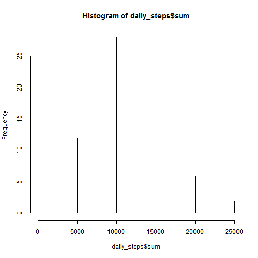
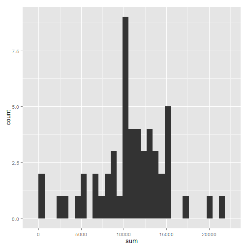
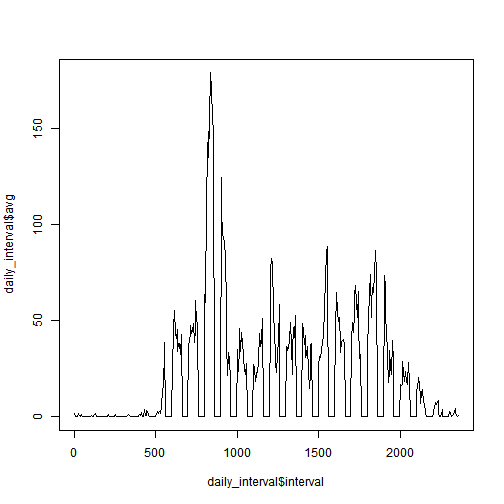
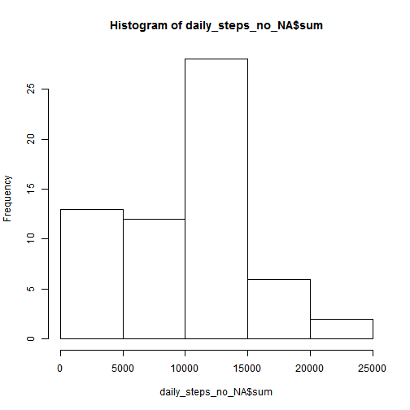
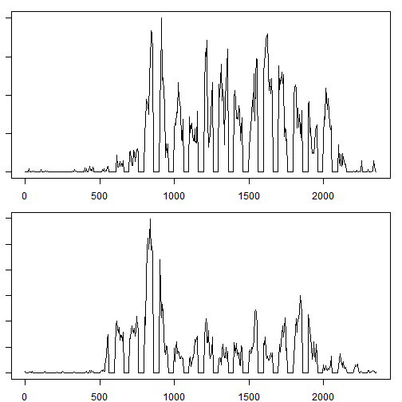

**REPRODUCIBLE RESEARCH**

**ASSIGNMENT 1**

**Mar 15, 2015**

# Loading and preprocessing the data

## Load the data

```r
library(ggplot2)
Sys.setlocale('LC_TIME', 'English') # Because I am using a Chinese OS.
```

```
## [1] "English_United States.1252"
```

```r
data <- read.csv('activity.csv', header = TRUE)
```

## Process/transform the data (if necessary) into a format suitable for your analysis

All NA data are transformed into zeroes. And all values of total steps walked at any particular time-point are calculated.

```r
data$total_steps[1] = 0
for (i in 1:nrow(data)) {
    if (is.na(data$steps[i])) {
        data$steps_no[i] = 0
    } else {
        data$steps_no[i] = data$steps[i]
    }
}
for (i in 2:nrow(data)) {
    data$total_steps[i] = data$total_steps[i-1] + data$steps_no[i]
}
```

# What is mean total number of steps taken per day?

Dates are transformed into numbers of day.

```r
for (i in 1:nrow(data)) {
    data$day[i] = as.numeric(data$date[i])
}
```

## Total numbers of steps per day are calculated and stored into a new dataset.

```r
total_days = max(data$day)
daily_steps = data.frame(1:total_days)
colnames(daily_steps) = "day"
for (i in 1:total_days) {
    temp_data = subset(data, day == i)
    daily_steps$sum[i] <- sum(temp_data$steps)
}
```

## Total numbers of steps per day are calculated.

```r
print(daily_steps)
```

```
##    day   sum
## 1    1    NA
## 2    2   126
## 3    3 11352
## 4    4 12116
## 5    5 13294
## 6    6 15420
## 7    7 11015
## 8    8    NA
## 9    9 12811
## 10  10  9900
## 11  11 10304
## 12  12 17382
## 13  13 12426
## 14  14 15098
## 15  15 10139
## 16  16 15084
## 17  17 13452
## 18  18 10056
## 19  19 11829
## 20  20 10395
## 21  21  8821
## 22  22 13460
## 23  23  8918
## 24  24  8355
## 25  25  2492
## 26  26  6778
## 27  27 10119
## 28  28 11458
## 29  29  5018
## 30  30  9819
## 31  31 15414
## 32  32    NA
## 33  33 10600
## 34  34 10571
## 35  35    NA
## 36  36 10439
## 37  37  8334
## 38  38 12883
## 39  39  3219
## 40  40    NA
## 41  41    NA
## 42  42 12608
## 43  43 10765
## 44  44  7336
## 45  45    NA
## 46  46    41
## 47  47  5441
## 48  48 14339
## 49  49 15110
## 50  50  8841
## 51  51  4472
## 52  52 12787
## 53  53 20427
## 54  54 21194
## 55  55 14478
## 56  56 11834
## 57  57 11162
## 58  58 13646
## 59  59 10183
## 60  60  7047
## 61  61    NA
```

## A histogram of the total number of steps taken each day is created.

```r
hist(daily_steps$sum)
```

 

```r
ggplot(daily_steps, aes(x = sum)) + geom_histogram()
```

```
## stat_bin: binwidth defaulted to range/30. Use 'binwidth = x' to adjust this.
```

 

## Calculating the mean and median total number of steps taken per day

```r
total_steps <- as.matrix(summary(daily_steps$sum))
mean = total_steps[4,1]
median = total_steps[3,1]
```
Mean of the total number of steps taken per day is 1.077 &times; 10<sup>4</sup>.
Median of the total number of steps taken per day is 1.076 &times; 10<sup>4</sup>.

# What is the average daily activity pattern?

## A time series plot (i.e. type = "l") of the 5-minute interval (x-axis) and the average number of steps taken, averaged across all days (y-axis):

Average number of steps taken across all days within 5-minute intervals is calcuated.

```r
max_interval = max(data$interval)
interval = seq(0, max_interval, 5)
daily_interval = data.frame(interval)
for (i in 0:(max_interval/5)) {
    temp_interval = subset(data, interval == i*5)
    temp_interval$steps[is.na(temp_interval$steps)] <- 0
    daily_interval$sum[i+1] <- sum(temp_interval$steps)
}
daily_interval$avg = daily_interval$sum / total_days
```

A time series plot is made.

```r
plot(x = daily_interval$interval, y = daily_interval$avg, type = 'l')
```

 

## Which 5-minute interval, on average across all the days in the dataset, contains the maximum number of steps?

```r
sorted <- daily_interval[order(daily_interval$avg),]
max_day <- sorted[nrow(sorted), 1]
```
No. 835 interval contains the maximum number of steps.


# Imputing missing values

## Calculate and report the total number of missing values in the dataset

```r
data.NA <- read.csv('activity.csv', header = TRUE)
total_no_NA = nrow(subset(data.NA, is.na(steps)))
```
Total number of missing values in the dataset is 2304.

## Devise a strategy for filling in all of the missing values in the dataset

```r
data$steps = data$steps_no
```
Note: Missing values have already been filled early on.

## Create a new dataset that is equal to the original dataset but with the missing data filled in.

```r
new.data <- data[, 1:3]
```

## Make a histogram of the total number of steps taken each day and Calculate and report the mean and median total number of steps taken per day. 


```r
daily_steps_no_NA = data.frame(1:total_days)
colnames(daily_steps_no_NA) = "day"
for (i in 1:total_days) {
    temp_data = subset(data, day == i)
    daily_steps_no_NA$sum[i] <- sum(temp_data$steps)
}
print(daily_steps_no_NA)
```

```
##    day   sum
## 1    1     0
## 2    2   126
## 3    3 11352
## 4    4 12116
## 5    5 13294
## 6    6 15420
## 7    7 11015
## 8    8     0
## 9    9 12811
## 10  10  9900
## 11  11 10304
## 12  12 17382
## 13  13 12426
## 14  14 15098
## 15  15 10139
## 16  16 15084
## 17  17 13452
## 18  18 10056
## 19  19 11829
## 20  20 10395
## 21  21  8821
## 22  22 13460
## 23  23  8918
## 24  24  8355
## 25  25  2492
## 26  26  6778
## 27  27 10119
## 28  28 11458
## 29  29  5018
## 30  30  9819
## 31  31 15414
## 32  32     0
## 33  33 10600
## 34  34 10571
## 35  35     0
## 36  36 10439
## 37  37  8334
## 38  38 12883
## 39  39  3219
## 40  40     0
## 41  41     0
## 42  42 12608
## 43  43 10765
## 44  44  7336
## 45  45     0
## 46  46    41
## 47  47  5441
## 48  48 14339
## 49  49 15110
## 50  50  8841
## 51  51  4472
## 52  52 12787
## 53  53 20427
## 54  54 21194
## 55  55 14478
## 56  56 11834
## 57  57 11162
## 58  58 13646
## 59  59 10183
## 60  60  7047
## 61  61     0
```

```r
hist(daily_steps_no_NA$sum)
```

 

```r
summary(daily_steps_no_NA$sum)
```

```
##    Min. 1st Qu.  Median    Mean 3rd Qu.    Max. 
##       0    6778   10400    9354   12810   21190
```

```r
total_steps_no_NA <- as.matrix(summary(daily_steps_no_NA$sum))
mean_no_NA = total_steps_no_NA[4,1]
median_no_NA = total_steps_no_NA[3,1]
```
**After filling missing values:**
Mean of the total number of steps taken per day is 9354.
Median of the total number of steps taken per day is 1.04 &times; 10<sup>4</sup>.
Both are different from those obtained from original data that contains NA data.


# Are there differences in activity patterns between weekdays and weekends?

## Create a new factor variable in the dataset with two levels – “weekday” and “weekend” indicating whether a given date is a weekday or weekend day.

```r
new.data$wd <- weekdays(as.Date(new.data$date, abbreviate = TRUE))
for (i in 1:nrow(new.data)) {
    if (new.data$wd[i] == 'Saturday' | new.data$wd[i] == 'Sunday') {
        new.data$wd_class[i] = 'WE'
    }
    else {
        new.data$wd_class[i] = 'WD'
    }
}
```

## Make a panel plot containing a time series plot (i.e. type = "l") of the 5-minute interval (x-axis) and the average number of steps taken, averaged across all weekday days or weekend days (y-axis). 

```r
new.data.WE <- subset(new.data, wd_class == 'WE')
new.data.WD <- subset(new.data, wd_class == 'WD')

new.data.WE_interval = data.frame(interval)
for (i in 0:(max_interval/5)) {
    temp_data_WE = subset(new.data.WE, interval == i*5)
    new.data.WE_interval$sum[i+1] <- sum(temp_data_WE$steps)
}
new.data.WE_interval$avg = new.data.WE_interval$sum / total_days / 2

new.data.WD_interval = data.frame(interval)
for (i in 0:(max_interval/5)) {
    temp_data_WD = subset(new.data.WD, interval == i*5)
    new.data.WD_interval$sum[i+1] <- sum(temp_data_WD$steps)
}
new.data.WD_interval$avg = new.data.WD_interval$sum / total_days / 5

par(mar = c(2, 1, 1, 1))
par(mfrow = c(2, 1))

WE <- plot(x = new.data.WE_interval$interval, y = new.data.WE_interval$avg, type = 'l')
WD <- plot(x = new.data.WD_interval$interval, y = new.data.WD_interval$avg, type = 'l')
```

 

There are differences in activity patterns between weekdays and weekends.
